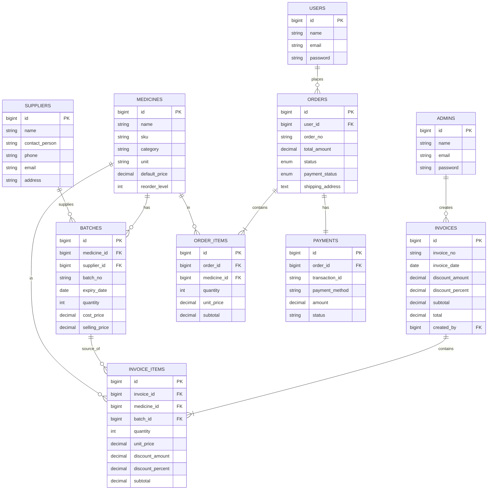

# Pharmacy Management System

## Database ER Diagram

```mermaid
erDiagram
    USERS ||--o{ ORDERS : places
    ADMINS ||--o{ INVOICES : creates
    SUPPLIERS ||--o{ BATCHES : supplies
    MEDICINES ||--o{ BATCHES : has
    MEDICINES ||--o{ INVOICE_ITEMS : in
    MEDICINES ||--o{ ORDER_ITEMS : in
    BATCHES ||--o{ INVOICE_ITEMS : source_of
    INVOICES ||--|{ INVOICE_ITEMS : contains
    ORDERS ||--|{ ORDER_ITEMS : contains
    ORDERS ||--|| PAYMENTS : has

    USERS {
        bigint id PK
        string name
        string email
        string password
    }

    ADMINS {
        bigint id PK
        string name
        string email
        string password
    }

    MEDICINES {
        bigint id PK
        string name
        string sku
        string category
        string unit
        decimal default_price
        int reorder_level
    }

    SUPPLIERS {
        bigint id PK
        string name
        string contact_person
        string phone
        string email
        string address
    }

    BATCHES {
        bigint id PK
        bigint medicine_id FK
        bigint supplier_id FK
        string batch_no
        date expiry_date
        int quantity
        decimal cost_price
        decimal selling_price
    }

    INVOICES {
        bigint id PK
        string invoice_no
        date invoice_date
        decimal discount_amount
        decimal discount_percent
        decimal subtotal
        decimal total
        bigint created_by FK
    }

    INVOICE_ITEMS {
        bigint id PK
        bigint invoice_id FK
        bigint medicine_id FK
        bigint batch_id FK
        int quantity
        decimal unit_price
        decimal discount_amount
        decimal discount_percent
        decimal subtotal
    }

    ORDERS {
        bigint id PK
        bigint user_id FK
        string order_no
        decimal total_amount
        enum status
        enum payment_status
        text shipping_address
    }

    ORDER_ITEMS {
        bigint id PK
        bigint order_id FK
        bigint medicine_id FK
        int quantity
        decimal unit_price
        decimal subtotal
    }

    PAYMENTS {
        bigint id PK
        bigint order_id FK
        string transaction_id
        string payment_method
        decimal amount
        string status
    }
```
