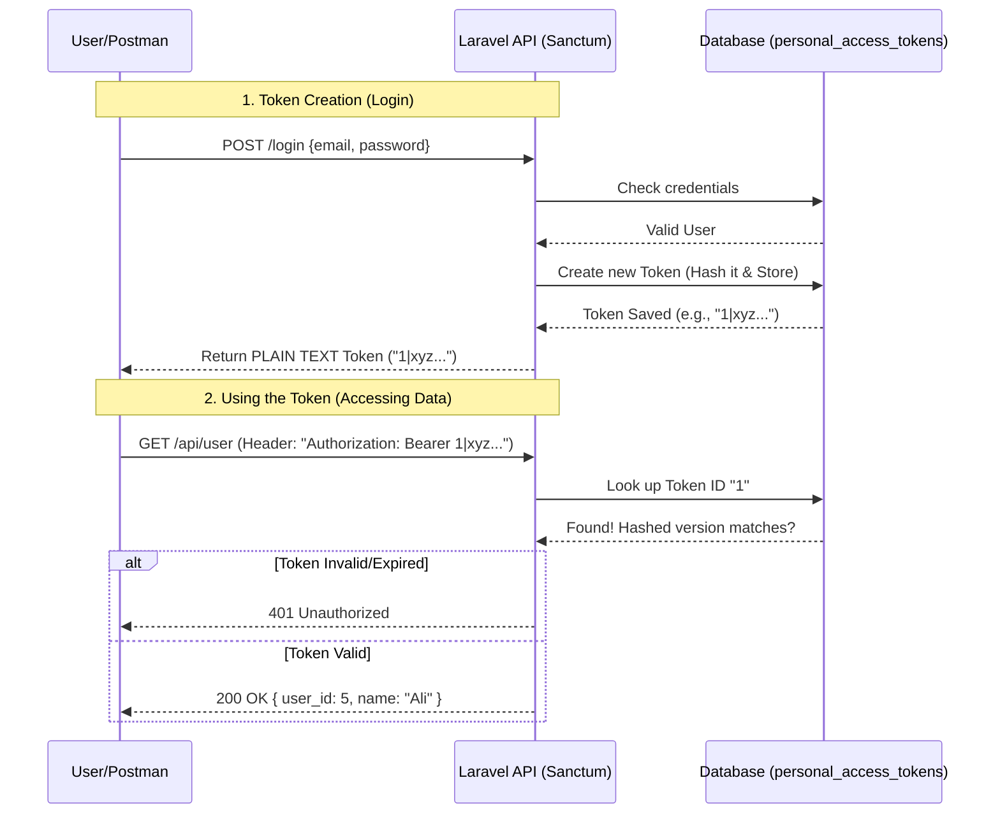

# Pharmacy Management System - Project Documentation

## 1. Project Overview
This project is a comprehensive **Pharmacy Management System** built with **Laravel**. It is designed to manage day-to-day pharmacy operations, including stock management, sales (Point of Sale), customer orders, supplier management, and financial reporting. The system features dual interfaces: one for *Administrators* (shop owners/pharmacists) and one for *Customers*.

### Tech Stack
-   **Framework**: Laravel 10+
-   **Language**: PHP
-   **Database**: MySQL
-   **Frontend**: Blade Templates, TailwindCSS, Vanilla JavaScript
-   **Payment Simulation**: Custom "Fake API" implementation

---

## 2. Folder Structure & Key Files

### Root Directory
-   `app/`: Core application logic (Controllers, Models).
-   `database/`: Migrations, Seeds, and SQLite/MySQL configurations.
-   `resources/`: Views (Blade files), CSS, and JS assets.
-   `routes/`: URL routing definitions (`web.php`, `api.php`).
-   `public/`: Entry point (images, compiled assets).
-   `config/`: Configuration files (app, database, auth).

### `app/` Directory Breakdown

#### Models (`app/Models/`)
Entities representing database tables.
-   **`User.php`**: Represents admin users and staff.
-   **`Medicine.php`**: Core product model. Attributes: `name`, `sku`, `category`, `price`, `stock`. Relationships: `hasMany` Batches.
-   **`Batch.php`**: Manages inventory patches. Tracks `expiry_date` and `quantity` for medicines.
-   **`Order.php`**: Customer orders. Attributes: `total_amount`, `status`, `payment_status`. Relationships: `User`, `OrderItems`, `Payment`.
-   **`Payment.php`**: records transaction details (`transaction_id`, `status`).
-   **`Supplier.php`**: Vendors who supply medicines.
-   **`Invoice.php`** & **`InvoiceItem.php`**: Records of completed sales transactions (POS).
-   **`Setting.php`**: System-wide configurations (Store Name, Currency, etc.).

#### Controllers (`app/Http/Controllers/`)
Handles incoming requests and logic.
-   **`AdminController.php`**: Main admin dashboard logic.
-   **`AdminLoginController.php`**: Layout-specific logic for admin authentication.
-   **`CustomerAuthController.php`**: Handles customer registration, login, and logout.
-   **`SalesController.php`**: Manages the Point of Sale (POS) interface and transaction storage.
-   **`OrderController.php`**: Handles customer cart checkout and order placement.
-   **`PaymentController.php`**: Manages the payment checkout flow, simulation logic, and receipts.
-   **`MedicineController.php`**: CRUD operations for medicines.
-   **`BatchController.php`**: Alert logic for expiring or low-stock batches.
-   **`ReportController.php`**: Generates daily sales and top medicine reports.

### `database/` Directory
-   **Migrations**:
    -   `create_users_table`: Admins/Staff.
    -   `create_medicines_table`: Product catalog.
    -   `create_batches_table`: Stock tracking with expiry.
    -   `create_orders_table`: Online customer orders.
    -   `create_payments_table`: Payment transaction logs.
    -   `create_invoices_table`: Walk-in sales records.

### `resources/views/` Directory
-   **`admin/`**: Admin panel views (Dashboard, Medicines, Sales, Settings).
-   **`auth/`**: Login/Register views for customers and admins.
-   **`cart/`**: Customer shopping cart UI.
-   **`layouts/`**: Master templates (`app.blade.php`, `admin.blade.php`).
-   **`payment/`**: Checkout simulation and receipt views.
-   **`sales/`**: POS Interface.

### `routes/` Directory
-   **`web.php`**:
    -   **Public**: Homepage, Product browsing.
    -   **Customer Auth**: Login/Register routes.
    -   **Cart**: Add/Remove items, Checkout.
    -   **Payment**: `/payment/checkout`, `/payment/simulate`, `/payment/confirm`.
    -   **Admin**: Protected by `auth:admin` middleware. Includes resources for Medicines, Suppliers, Batches, and Reports.

---

## 3. Data Flows

### A. Customer Order Flow
1.  **Browse & Cart**: Customer views medicines -> Adds to Session Cart (`CartController`).
2.  **Checkout**: Customer clicks Checkout -> `OrderController@store` creates an `Order` with `status='pending'` and `payment_status='pending'`.
3.  **Payment Initiation**: Redirects to `PaymentController@checkout`.
4.  **Simulation**: User enters card details -> `PaymentController@simulate` acts as a mock gateway (Random Success/Fail).
5.  **Confirmation**: On success, `PaymentController@confirm`:
    -   Creates `Payment` record.
    -   Updates `Order` `payment_status` to `'paid'`.
    -   Deducts stock (via Logic hooks).
6.  **Receipt**: Shows order summary.

### B. Admin Sales (POS) Flow
1.  **Interface**: Admin opens Sales page (`SalesController`).
2.  **Selection**: Search medicine -> Add to list -> Calculate Total.
3.  **Transaction**: Generates `Invoice` and `InvoiceItems`.
4.  **Stock Update**: Automatically decrements quantity from the oldest valid `Batch` (FIFO logic).

### C. Admin management Flow
1.  **Authentication**: Admin logs in via `AdminLoginController`.
2.  **Dashboard**: Sees alerts for Low Stock, Expiring Batches (`BatchController`).
3.  **Inventory**: Adds new `Medicine` -> Adds new `Batch` for that medicine.
4.  **Reporting**: Views Daily Sales charts and Top Selling Medicines (`ReportController`).

---

## 4. Architecture Highlights
-   **Middleware**: `auth` for customers, `auth:admin` for administrators.
-   **Database Transactions**: Used in Orders and Sales to ensure atomic updates (e.g., creating an order AND deducting stock happen together or not at all).
-   **Blade Components**: Reusable UI parts for consistent design.

---

## 5. API Usage

### Overview
This application primarily uses **Server-Side Rendering (SSR)** with regular HTTP requests. However, it implements a **Hybrid API Approach** for specific features like payment simulation.

### Total API Endpoints: 2 (Internal/Simulation)

1.  **Payment Simulation Endpoint (Internal)**
    -   **URL**: `/payment/simulate`
    -   **Method**: `POST`
    -   **Controller**: `PaymentController@simulate`
    -   **Purpose**: Acts as a "Fake Payment Gateway".
    -   **Input**: JSON `{ "order_id": 1, "amount": 500, "method": "card" }`
    -   **Output**: JSON `{ "status": "SUCCESS", "transaction_id": "SIM-123456" }` or `{ "status": "FAILED" }`.
    -   **Logic**: Returns a random 90% success rate to mimic real-world payment processing scenarios without an actual banking integration.

2.  **User Data Endpoint (Default)**
    -   **URL**: `/api/user`
    -   **Method**: `GET`
    -   **Middleware**: `auth:sanctum`
    -   **Purpose**: Default Laravel API route to fetch authenticated user details (currently unused in the main flow but available for future mobile app expansion).

### How it Works
-   **AJAX / Fetch**: The frontend (Blade views) uses JavaScript `fetch()` or `axios` to call `/payment/simulate`.
-   **JSON Responses**: The Controller returns `response()->json([...])` instead of a View.
-   **No External APIs**: The project currently does **not** rely on third-party external APIs (like Stripe, PayPal, or Google Maps). All logic is self-contained.

### Guide: How to Access `/api/user`
To access the protected `/api/user` endpoint and receive JSON data, you cannot simply visit the URL in the browser because it requires authentication via Laravel Sanctum. You have two options:

#### Option A: Token Authentication (Recommended for Postman/External Tools)
1.  **Generate a Token**: You need to generate a token for a user. You can do this via `php artisan tinker`:
    ```php
    $user = \App\Models\User::first();
    echo $user->createToken('TestToken')->plainTextToken;
    ```
2.  **Make Request**: Use this token in the `Authorization` header.
    -   **Header**: `Authorization: Bearer <your-generated-token>`
    -   **URL**: `http://localhost:8000/api/user`

#### Option B: Browser Session (Requires Config Change)
If you want to access it directly in the browser while logged in as an admin/customer:
1.  **Edit Kernel**: Open `app/Http/Kernel.php`.
2.  **Uncomment Line**: Uncomment `\Laravel\Sanctum\Http\Middleware\EnsureFrontendRequestsAreStateful::class` in the `api` middleware group.
3.  **Visit URL**: Log in to the application normally, then visit `http://localhost:8000/api/user`. You will now see the JSON response instead of an authentication error.

### See Also
-   [Deep Dive: Authentication & Architecture](#6-deep-dive-authentication-architecture) below for more details on how this works.

---


## 6. Deep Dive: Authentication, Roles & API Architecture

### A. Role-Based Access Control (RBAC)
This project uses a **Multi-Guard Authentication System**, not a single "role" column in a user table.

1.  **Two Distinct User Types**:
    -   **Customers (`User` model)**: Stored in `users` table. Authenticated via the default `web` guard.
    -   **Admins (`Admin` model)**: Stored in `admins` table. Authenticated via a custom `admin` guard.

2.  **Guards (`config/auth.php`)**:
    -   `web`: Uses the `users` provider (Session-based).
    -   `admin`: Uses the `admins` provider (Session-based).

3.  **Middleware Protection**:
    -   Routes wrapped in `middleware('auth')` -> Only accessible by logged-in **Customers**.
    -   Routes wrapped in `middleware('auth:admin')` -> Only accessible by logged-in **Admins**.

### B. Understanding Laravel Sanctum (The "VIP Pass" System)

Think of **Sanctum** as a security checkpoint at an event.
-   **The User**: A guest trying to enter.
-   **The Token**: A generic VIP wristband.
-   **The Database**: The guest list + details about which wristband belongs to whom.

#### The Sanctum Flow Diagram


#### Step-by-Step Breakdown
1.  **Creation**: When you ask to create a token (`$user->createToken('MyPhone')`), Laravel generates a long random string.
2.  **Storage**:
    -   It **Hashes** the token (like a password) and stores it in the `personal_access_tokens` table.
    -   It links this token to your specific User ID (`tokenable_id`).
3.  **Delivery**: It gives YOU the **plain text** version (e.g., `1|AbCdEf...`). **Keep this safe!** You will never see it again.
4.  **Usage**:
    -   You attach this token to every request header.
    -   Sanctum intercepts the request, grabs the token, hashes it, and checks if it exists in the database.
    -   If it acts like a key that fits the lock, the door opens (Route is accessible).

1.  **Entry Point (`index.php`)**: The request hits `public/index.php`.
2.  **HTTP Kernel (`app/Http/Kernel.php`)**:
    -   The request travels through global **Middleware** (CORS, TrustProxies).
3.  **Routing (`routes/web.php`)**:
    -   Laravel matches the URL `/payment/simulate` to a route definition.
    -   It sees the `middleware('auth')` requirement.
4.  **Middleware Check**:
    -   Laravel checks if the user is logged in.
    -   *If No*: Redirects to `/login`.
    -   *If Yes*: Passes the request to the Controller.
5.  **Controller Action (`PaymentController@simulate`)**:
    -   **Input**: The controller receives a `Request $request` object containing form data/JSON (e.g., `amount`, `method`).
    -   **Validation**: `$request->validate([...])` ensures data is correct.
    -   **Logic**: Executes the 90% success/fail RNG logic.
    -   **Response**: Returns `response()->json(['status' => 'SUCCESS'])`.
6.  **Output**: Middleware cleans up the response (adds headers) and sends JSON back to the browser/client.

#### Middleware Role
Think of Middleware as **Security Guards** at the door.
-   **`auth`**: "Show me your ID (Session/Token). If you don't have one, go to the waiting room (Login Page)."
-   **`VerifyCsrfToken`**: "Do you have the secret key? (Prevents hackers from submitting forms on your behalf)."
-   **`TrimStrings`**: "I'll remove extra spaces from your name tag."

In this project, Middleware ensures that **Admins** cannot access **Customer** pages (and vice versa) and that anonymous users cannot see sensitive data.
